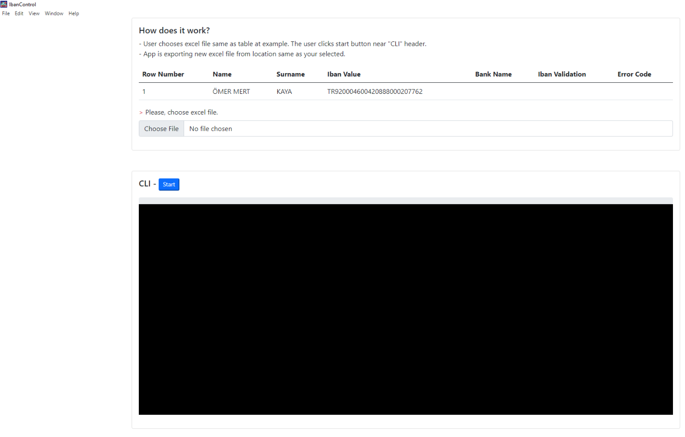
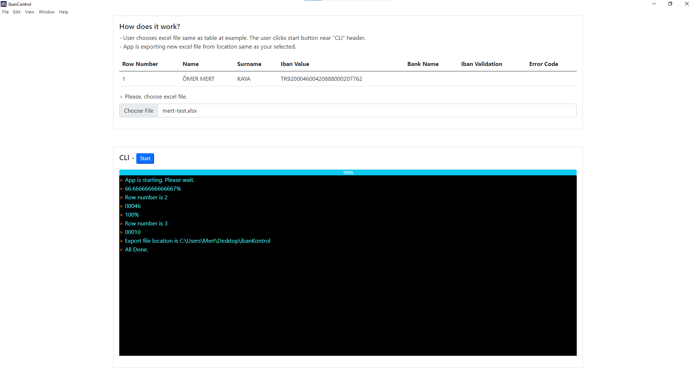
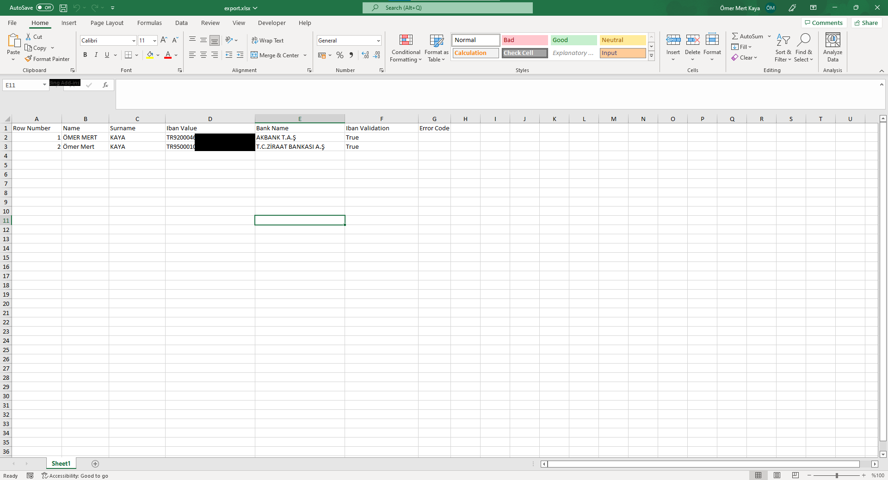

# iban-validation-desktop-app
App is iban validation. User choose excel file for iban validation. App will verify for Turkish Bank Name.


### Installation Project

1. Clone the repo
   ```sh
   git clone https://github.com/omermertkaya/iban-validation-desktop-app.git
   ```
3. Install NPM packages
   ```sh
   npm install
   ```
4. Start App
   ```sh
   npm start
   ```

### Build for Windows Desktop App

1. Clone the repo
   ```sh
   electron-packager ./ IBANAPP --platform=win32 --arch=x64 --icon="./img/iban-kontrol.ico"
   ```

### Screen View

------------




------------




------------



------------


